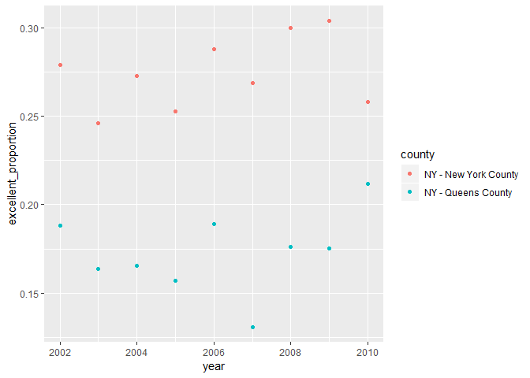

p8105\_hw2\_alc2279
================
Annie Clark
September 29, 2018

General questions - do we need to print everything? even when just load/clean data?

Problem 0
=========

This “problem” focuses on structure of your submission, especially the use git and GitHub for reproducibility, R Projects to organize your work, R Markdown to write reproducible reports, relative paths to load data from local files, and reasonable naming structures for your files.

To that end:

-   create a public GitHub repo + local R Project; we suggest naming this repo / directory p8105\_hw2\_YOURUNI (e.g. p8105\_hw2\_ajg2202 for Jeff), but that’s not required
-   create a single .Rmd file named p8105\_hw2\_YOURUNI.Rmd that renders to github\_document
-   create a subdirectory to store the local data files used in Problems 1 and 2, and use relative paths to access these data files
-   Your solutions to Problems 1, 2, and 3 should be implemented in your .Rmd file, and your git commit history should reflect the process you used to solve these problems.

For this Problem, we will assess adherence to the instructions above regarding repo structure, git commit history, and whether we are able to knit your .Rmd to ensure that your work is reproducible. Adherence to appropriate styling and clarity of code will be assessed in Problems 1+.

Problem 1
=========

Part 1: Read and clean data
---------------------------

This problem focuses on NYC Transit data; in particular, this CSV file contains information related to each entrance and exit for each subway station in NYC.

Read and clean the data; retain line, station, name, station latitude / longitude, routes served, entry, vending, entrance type, and ADA compliance. Convert the entry variable from character (YES vs NO) to a logical variable (the ifelse or recode function may be useful).

``` r
library(tidyverse)
```

    ## -- Attaching packages ------------------------------------------------------------------------- tidyverse 1.2.1 --

    ## v ggplot2 3.0.0     v purrr   0.2.5
    ## v tibble  1.4.2     v dplyr   0.7.6
    ## v tidyr   0.8.1     v stringr 1.3.1
    ## v readr   1.1.1     v forcats 0.3.0

    ## -- Conflicts ---------------------------------------------------------------------------- tidyverse_conflicts() --
    ## x dplyr::filter() masks stats::filter()
    ## x dplyr::lag()    masks stats::lag()

``` r
subway_data = 
  read_csv(file = "./data/NYC_Transit_Subway_Entrance_And_Exit_Data.csv") %>% 
  janitor::clean_names() %>% 
  select(line:entry, vending, ada) %>% 
  mutate(entry = entry == "YES")
```

    ## Parsed with column specification:
    ## cols(
    ##   .default = col_character(),
    ##   `Station Latitude` = col_double(),
    ##   `Station Longitude` = col_double(),
    ##   Route8 = col_integer(),
    ##   Route9 = col_integer(),
    ##   Route10 = col_integer(),
    ##   Route11 = col_integer(),
    ##   ADA = col_logical(),
    ##   `Free Crossover` = col_logical(),
    ##   `Entrance Latitude` = col_double(),
    ##   `Entrance Longitude` = col_double()
    ## )

    ## See spec(...) for full column specifications.

``` r
View(subway_data)
class(subway_data$entry)
```

    ## [1] "logical"

Part 2: Describe dataset
------------------------

Prompt:
-------

Write a short paragraph about this dataset – explain briefly what variables the dataset contains, describe your data cleaning steps so far, and give the dimension (rows x columns) of the resulting dataset. Are these data tidy?

Response
--------

The dataset, subway\_data, includes charcteristics of every subway entrance or exit; more specifically, it includes data about what lines and routes can be accessed by each entrance/exit (line and route1:route11), its location, (station\_latitude, station\_longitude), and some important characteristics, like if entry is allowed as opposed to just an exit (entry), if there is vending available to buy tickets (vending), how the entrance/exit is accessible (i.e. by stair, elevator, etc.) (entrance\_type), and lastly if the entrance/exit is approved by the ADA (ada). In the original dataset, there was additional information included, like whether there is staffing, if crossovers are available (to a different line) and several variables about the location and cross streets of the entrance. These additional variables are not important to us for this exercise.

So far, I have paired down the data to the relevant variables, standardized the names (i.e. made them lower case and removed spaces/special characters), and converted the entry variable from character to logical, which will be useful in the analysis.

So far, this tabel that consists of 1868 rows and 19 columns is not yet considered to be "tidy." The 11 columns that contain route information need to be gathered into one variable (and additionally cleaned up), the vending variable should be changed to logical, the entrance\_type variable could probably be changed to factor, and I would want to play around with cleaning up station\_name and line (i.e. standardizing the case and possible the names, i.e. avenue vs. ave).

Part 3: Answer some questions
-----------------------------

-   How many distinct stations are there? Note that stations are identified both by name and by line (e.g. 125th St A/B/C/D; 125st 1; 125st 4/5); the distinct function may be useful here.

``` r
subway_data %>% 
  distinct(.data = ., station_name, line) %>% 
  nrow(.)
```

    ## [1] 465

``` r
distinct(subway_data, entrance_type)
```

    ## # A tibble: 7 x 1
    ##   entrance_type
    ##   <chr>        
    ## 1 Stair        
    ## 2 Elevator     
    ## 3 Easement     
    ## 4 Escalator    
    ## 5 Door         
    ## 6 Ramp         
    ## 7 Walkway

-   How many stations are ADA compliant?

``` r
subway_data %>%
  filter(ada == TRUE) %>%
  distinct(.data = ., station_name, line) %>% 
  nrow(.)
```

    ## [1] 84

-   What proportion of station entrances / exits without vending allow entrance?

``` r
subway_data %>% 
  filter(vending == "NO") %>%
  mean(entry)
```

    ## Warning in mean.default(., entry): argument is not numeric or logical:
    ## returning NA

    ## [1] NA

``` r
class(subway_data$entry)
```

    ## [1] "logical"

``` r
#Question - not returning mean correctly -- saying that it is not logical nor numeric, but it is
```

Part 4: Another exericse
------------------------

Reformat data so that route number and route name are distinct variables.

``` r
subway_data =  
  gather(subway_data, key = route_num, value = route_name, route1:route11) %>% 
  separate(route_num, into = c("route", "route_num"), sep = 5) %>%
  select(line:ada, route_num, route_name)
```

How many distinct stations serve the A train?

``` r
subway_data %>% 
  filter(route_name == "A") %>% 
  distinct(.data = ., station_name) %>% 
  nrow(.)
```

    ## [1] 56

Of the stations that serve the A train, how many are ADA compliant?

``` r
subway_data %>% 
  filter(route_name == "A", ada == TRUE) %>% 
  distinct(.data = ., station_name) %>% 
  nrow(.)
```

    ## [1] 16

Problem 2
=========

Part 1: Read and clean data
---------------------------

This problem uses the Mr. Trash Wheel dataset, available as an Excel file on the course website. Please use the HealthyHarborWaterWheelTotals2017-9-26.xlsx version.

Read and clean the Mr. Trash Wheel sheet:

-   specify the sheet in the Excel file and to omit columns containing notes (using the range argument and cell\_cols() function)
-   use reasonable variable names
-   omit rows that do not include dumpster-specific data
-   round the number of sports balls to the nearest integer and converts the result to an integer variable (using as.integer)

``` r
library(readxl)

water_wheel_data = read_excel("./data/HealthyHarborWaterWheelTotals2017-9-26.xlsx", 
                              sheet = "Mr. Trash Wheel",
                              range = cell_cols("A:N")) %>% 
  janitor::clean_names() %>% 
  filter(!is.na(dumpster),
         month != "Grand Total") %>% 
  mutate(sports_balls = as.integer(round(sports_balls)))
```

Read and clean precipitation data for 2016 and 2017. For each, omit rows without precipitation data and add a variable year.

``` r
precipitation_2016_data = read_excel("./data/HealthyHarborWaterWheelTotals2017-9-26.xlsx", 
                              sheet = "2016 Precipitation",
                              range = "A2:B14") %>%
  janitor::clean_names() %>% 
  rename(precipitation_in = total) %>% 
  filter(!is.na(precipitation_in)) %>% 
  mutate(year = "2016")

precipitation_2017_data = read_excel("./data/HealthyHarborWaterWheelTotals2017-9-26.xlsx", 
                              sheet = "2017 Precipitation",
                              range = "A2:B14") %>% 
  janitor::clean_names() %>% 
  rename(precipitation_in = total) %>% 
  filter(!is.na(precipitation_in)) %>% 
  mutate(year = "2017")

##add comment about why using range? rather than colcells?
```

Next, combine datasets and convert month to a character variable (the variable month.name is built into R and should be useful).

``` r
precipitation_data = bind_rows(precipitation_2016_data, precipitation_2017_data) %>% 
  mutate(month = month.name[month])
```

Part 2: Describe dataset
------------------------

Write a paragraph about these data; you are encouraged to use inline R. Be sure to note: \* the number of observations in both resulting datasets \* give examples of key variables For available data, what was the total precipitation in 2017? What was the median number of sports balls in a dumpster in 2016?

Problem 3
=========

Part 1: Read and clean data
---------------------------

This problem uses the BRFSS data. DO NOT include this dataset in your local data directory; instead, load the data from the p8105.datasets package.

For this question:

-   format the data to use appropriate variable names
-   focus on the “Overall Health” topic
-   exclude variables for class, topic, question, sample size, and everything from lower confidence limit to GeoLocation
-   structure data so that responses (excellent to poor) are variables taking the value of Data\_value
-   create a new variable showing the proportion of responses that were “Excellent” or “Very Good”

``` r
#devtools::install_github("p8105/p8105.datasets")

library(p8105.datasets)

brfss_data = brfss_smart2010 %>% 
  janitor::clean_names() %>% 
  rename(state = locationabbr, county = locationdesc) %>% 
  filter(topic == "Overall Health") %>% 
  select(-(class:question), -sample_size, -(confidence_limit_low:geo_location)) %>% 
  spread(key = response, value = data_value) %>% 
  janitor::clean_names() %>% 
  select(year:county, excellent, very_good, good, fair, poor) %>% 
  mutate(high_response_proportion = (excellent + very_good) / 
           (excellent + very_good + good + fair + poor))

sum(brfss_data$excellent, brfss_data$poor)
```

    ## [1] NA

``` r
##Question - is there a more elegant way to do the proportion? -- logical and then take mean?
```

Part 2: Answer some questions
-----------------------------

Using this dataset, do or answer the following:

-   How many unique locations are included in the dataset? Is every state represented? What state is observed the most?

``` r
brfss_data_test = 
  mutate(brfss_data, concat = paste(state, county, sep = '-'))

nrow(distinct(brfss_data, county))
```

    ## [1] 404

``` r
#assuming that the data are correct and the state always equals the county(this might not
#always be the case, due to typos, etc. )

nrow(distinct(brfss_data, state))
```

    ## [1] 51

``` r
##assuming all 50 states plus DC are represented

brfss_data %>% 
  count(state) %>% 
  arrange(desc(n))
```

    ## # A tibble: 51 x 2
    ##    state     n
    ##    <chr> <int>
    ##  1 NJ      146
    ##  2 FL      122
    ##  3 NC      115
    ##  4 WA       97
    ##  5 MD       90
    ##  6 MA       79
    ##  7 TX       71
    ##  8 NY       65
    ##  9 SC       63
    ## 10 CO       59
    ## # ... with 41 more rows

-   In 2002, what is the median of the “Excellent” response value?

``` r
brfss_2002_data = 
  brfss_data %>%
  filter(year == 2002)

median(brfss_2002_data$excellent, na.rm = TRUE)
```

    ## [1] 23.6

``` r
##brfss_2002_data = 
##  brfss_data %>%
##  filter(year == 2002) %>% 
##  median(brfss_2002_data$excellent, na.rm = TRUE)


#Question - create new dataset??????? is there a way to pipe into median?
```

-   Make a histogram of “Excellent” response values in the year 2002.

``` r
ggplot(brfss_2002_data, aes(x = excellent)) + 
  geom_histogram()
```

    ## `stat_bin()` using `bins = 30`. Pick better value with `binwidth`.

    ## Warning: Removed 2 rows containing non-finite values (stat_bin).


-   Make a scatterplot showing the proportion of “Excellent” response values in New York County and Queens County (both in NY State) in each year from 2002 to 2010.

``` r
brfss_queens_ny_data = 
  brfss_data %>%
  filter(county %in% c("NY - Queens County", "NY - New York County")) %>% 
  mutate(excellent_proportion = excellent / (excellent + very_good + good + fair + poor))

ggplot(brfss_queens_ny_data, aes(x = year, y = excellent_proportion)) + 
  geom_point(aes(color = county))
```


